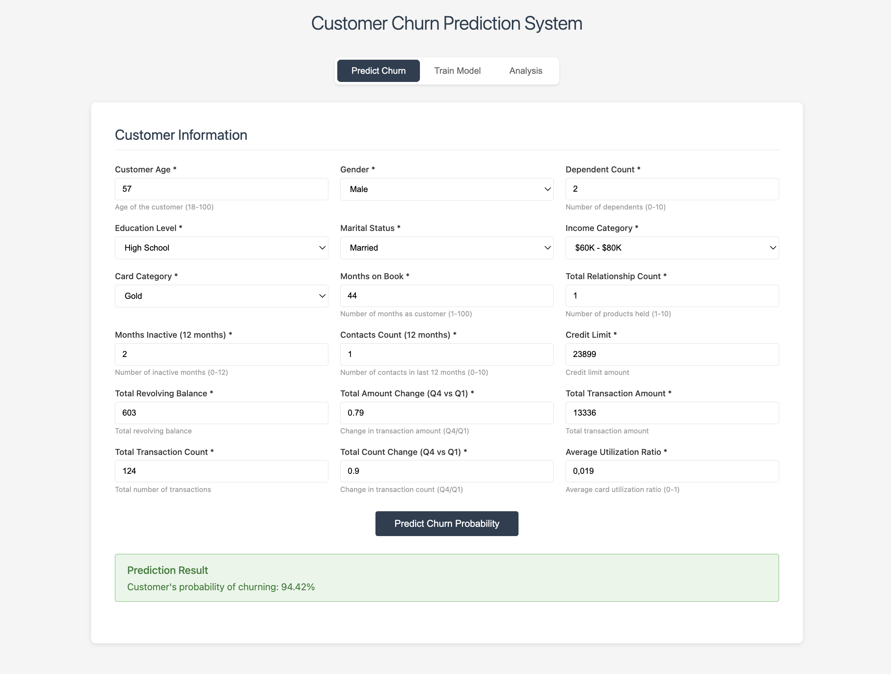

# Credit Card Customer Churn Prediction



## Project Overview
As the name suggests, this is a machine learning project that predicts customer probability of churning. This project provides an end-to-end process from data preprocessing to an interactive web interface. 

This project implements a customer churn prediction system leveraging the [Credit Card Customer](https://www.kaggle.com/datasets/sakshigoyal7/credit-card-customers) from kaggle. Before building web-app interface I developed some analysis from EDA to modeling in notebooks. 

## Features
- **Analysis & Modeling Report**: .ipynb files that contains the EDA & Modeling process in-depth


- **Interactive Web Application**: User-friendly interface for making real-time churn predictions
- **Model Training Interface**: Built-in functionality to retrain models with updated data
- **Feature Engineering Pipeline**: Automated preprocessing including encoding, feature selection, and transformation

## Project Structure

```
Customer-Churn-Prediction/
├── artifacts/                 # Saved models, preprocessors, and processed data
│   ├── model.pkl             # Trained LightGBM model
│   ├── preprocessor.pkl      # Data preprocessing pipeline
│   ├── feature_selector.pkl  # Feature selection transformer
│   ├── train.csv             # Training dataset
│   └── test.csv              # Test dataset
├── data/                      # Raw data files
│   └── BankChurners.csv      # Original dataset
├── logs/                      # Application logs
├── notebooks/                 # Jupyter notebooks for analysis
│   ├── Exploratory_Data_Analysis.ipynb
│   └── Modeling.ipynb
├── src/                       # Source code
│   ├── components/           # Core ML components
│   │   ├── data_ingestion.py
│   │   ├── data_transformation.py
│   │   └── model_trainer.py
│   ├── pipeline/             # Training and prediction pipelines
│   │   ├── train_pipeline.py
│   │   └── predict_pipeline.py
│   ├── modeling_utils.py     # Custom transformers and utilities
│   ├── eda_utils.py          # EDA helper functions
│   ├── logger.py             # Logging configuration
│   ├── exception.py          # Custom exception handling
│   └── utils.py              # Utility functions
├── static/                    # Static files (HTML reports)
│   ├── Exploratory_Data_Analysis.html
│   └── Modeling.html
├── templates/                 # HTML templates
│   └── index.html            # Main web interface
├── main.py                    # FastAPI application entry point
└── requirement.txt           
```

## Installation

### Setup Instructions

1. **Clone the repository**
   ```bash
   git clone <repository-url>
   cd Customer-Churn-Prediction
   ```

2. **Create virtual environment & install dependencies**
   ```bash
   python3 -m venv venv
   source venv/bin/activate
   pip install -r requirements.txt
   ```
   

## How to use the web app

### Starting the Web Application

1. **Start the FastAPI server**
   ```bash
   uvicorn main:app --reload
   ```

2. **Access the web interface**
   
   Open your browser and navigate to:
   ```
   http://localhost:8000/home
   ```

   Or access the API documentation at:
   ```
   http://localhost:8000/docs
   ```

### Using the Web Interface

The web application provides three main tabs:

1. **Predict Churn Tab**
   - Enter customer information including:
     - Demographics (age, gender, education, marital status, income)
     - Account details (card category, months on book, relationship count)
     - Transaction history (credit limit, revolving balance, transaction amounts)
     - Activity metrics (months inactive, contacts count, utilization ratio)
   - Click "Predict Churn Probability" to get the prediction
   - The system returns the probability percentage of customer churning

2. **Train Model Tab**
   - Click "Train Model" to retrain the model with the current dataset
   - The training process includes:
     - Data ingestion and splitting
     - Feature engineering and preprocessing
     - Model training with optimized hyperparameters
     - Model evaluation and saving

3. **Analysis Tab**
   - View the Exploratory Data Analysis report
   - View the Modeling report
   - These reports provide insights into data patterns and model performance

## Model Details

### Algorithm
The system uses **LightGBM** (Light Gradient Boosting Machine), a gradient boosting framework that provides high performance and accuracy for classification tasks.

### Hyperparameters
The model uses optimized hyperparameters found through Bayesian optimization:
- Objective: Binary classification
- Metric: ROC-AUC
- Number of estimators: 1000
- Learning rate: 0.0175
- Number of leaves: 942
- Subsample: 0.849
- Column sample by tree: 0.378
- Minimum data in leaf: 90
- Class weight: Balanced (to handle imbalanced data)

### Feature Engineering
The preprocessing pipeline includes:
1. **Feature Engineering**: Creation of derived features
2. **One-Hot Encoding**: Applied to gender
3. **Ordinal Encoding**: Applied to education level, income category, and card category
4. **Target Encoding**: Applied to marital status
5. **Column Dropping**: Removal of irrelevant features
6. **Recursive Feature Elimination**: Automatic selection of most important features using LightGBM as estimator

### Evaluation Metrics
- **ROC-AUC Score**: Primary metric for model evaluation (handles imbalanced data well)
- **Classification Report**: Includes precision, recall, F1-score for each class
- **Stratified K-Fold Cross-Validation**: Used during model development to ensure robust performance

## API Endpoints

### GET `/home`
Returns the main web interface HTML page.

### POST `/predict/`
Makes a churn prediction based on customer data.

**Request Body:**
```json
{
  "customer_age": 45,
  "gender": "M",
  "dependent_count": 2,
  "education_level": "Graduate",
  "marital_status": "Married",
  "income_category": "$60K - $80K",
  "card_category": "Blue",
  "months_on_book": 36,
  "total_relationship_count": 3,
  "months_inactive_12_mon": 2,
  "contacts_count_12_mon": 3,
  "credit_limit": 15000,
  "total_revolving_bal": 2000,
  "total_amt_chng_q4_q1": 0.8,
  "total_trans_amt": 5000,
  "total_trans_ct": 50,
  "total_ct_chng_q4_q1": 0.9,
  "avg_utilization_ratio": 0.3
}
```

**Response:**
```json
{
  "churn_prediction": "Customer's probability of churning: 15.234%"
}
```

### POST `/training/`
Initiates model training process.

**Response:**
```
Model training completed successfully.
```

## Data Requirements

The model requires the following customer features:

- **Demographics**: Customer age, gender, dependent count, education level, marital status, income category
- **Account Information**: Card category, months on book, total relationship count
- **Activity Metrics**: Months inactive in last 12 months, contacts count in last 12 months
- **Financial Metrics**: Credit limit, total revolving balance, average utilization ratio
- **Transaction History**: Total transaction amount, total transaction count, quarterly changes in amount and count

## Logging

The application logs all operations to the `logs/` directory with timestamps. Log files are organized by date and time of execution, making it easy to track training and prediction activities.

## Future Work

- Provide more details on the training process (includes)
- Containerize the application using Docker
- Deploy to cloud platforms (AWS, GCP, Azure)
- Implement CI/CD pipeline for automated testing and deployment
- Set up monitoring and alerting systems


